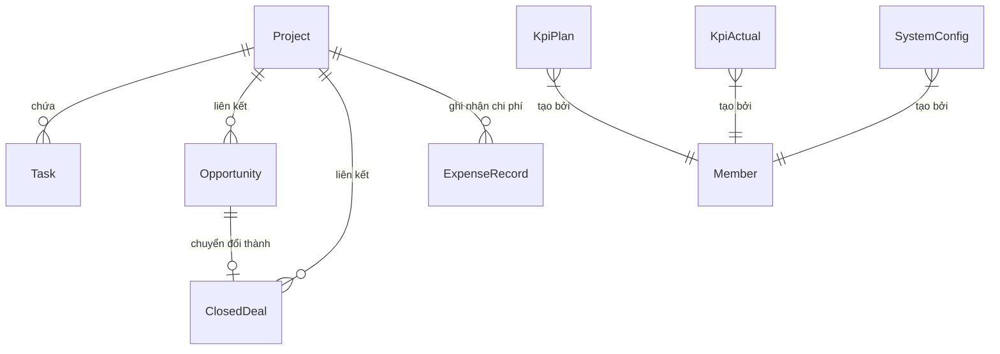

# Hướng dẫn & Đặc tả chi tiết: Module 1 - Dashboard (Dành cho Lập trình viên mới)

Chào mừng bạn đã tham gia dự án **Marketing Hub (Mkt Hub)**! Tài liệu này được thiết kế dành riêng cho bạn để nhanh chóng làm quen, hiểu rõ bức tranh toàn cảnh về mặt nghiệp vụ, luồng xử lý và chi tiết kỹ thuật của **Module Dashboard** trong hệ thống Backend.

---

## 💡 1. Bối cảnh nghiệp vụ của Dashboard (Business Context)

Hệ thống Marketing Hub được xây dựng nhằm giúp các nhà quản lý (Managers) và chuyên viên (Specialists) theo dõi, phân tích hiệu quả hoạt động Marketing và Kinh doanh của công ty theo các chu kỳ thời gian (Tuần, Tháng, Quý, Năm). 

Dashboard đóng vai trò là "trung tâm đầu não", tổng hợp dữ liệu từ nhiều nguồn khác nhau để cung cấp cái nhìn trực quan về:
1. **Phễu chuyển đổi Marketing & Sales (Funnel):** Theo dõi số lượng khách hàng tiềm năng qua các giai đoạn:
   * **Raw Leads** (Khách hàng thô) $\rightarrow$ **MQL** (Khách hàng đủ điều kiện Marketing) $\rightarrow$ **SQL** (Khách hàng đủ điều kiện Sales) $\rightarrow$ **OPP** (Cơ hội bán hàng) $\rightarrow$ **Closed Deal** (Hợp đồng thành công).
2. **Hiệu quả tài chính (CAC & LTV):**
   * **CAC (Customer Acquisition Cost):** Chi phí trung bình để có một khách hàng mới trong kỳ.
   * **LTV (Lifetime Value):** Giá trị trọn đời ước tính mà một khách hàng đem lại.
   * **Tỉ số LTV/CAC:** Thước đo sức khỏe của mô hình kinh doanh (Tỉ số lý tưởng thường là $\ge 3.0$ hoặc $\ge 4.0$).
3. **Tiến độ dự án & Công việc (Project Progress & Task Management):** Theo dõi tiến độ dựa trên số lượng công việc đã hoàn thành (`Done`) trên tổng số công việc, kèm theo các cảnh báo sớm về công việc quá hạn hoặc sắp đến hạn.

---

## 🗄️ 2. Sơ đồ dữ liệu & Mối quan hệ liên quan (Database Schema Relationships)

Để hiểu rõ dữ liệu được lấy từ đâu, bạn cần nắm rõ mối quan hệ giữa các bảng trong cơ sở dữ liệu (Prisma Schema):



* **`Project`**: Lưu thông tin các dự án. Dashboard chỉ tổng hợp dữ liệu từ các dự án có trạng thái `status: "Active"`.
* **`Task`**: Các đầu việc cụ thể trong dự án, có `dueDate` (hạn chót) và `status` (`To Do`, `In Progress`, `Review`, `Done`, `Cancel`).
* **`KpiPlan`**: Chứa mục tiêu kế hoạch (Target) được thiết lập cho cả năm (ví dụ: mục tiêu số lượng Leads, MQL, SQL... của năm 2026).
* **`KpiActual`**: Ghi nhận số liệu thực tế đạt được theo từng tuần (`week`) trong năm (`year`).
* **`Opportunity` & `ClosedDeal`**: Các cơ hội bán hàng và hợp đồng thành công để tính toán doanh thu tiềm năng, doanh thu thực tế và chỉ số LTV.
* **`ExpenseRecord`**: Chi phí vận hành trực tiếp (`directCost`) và chi phí gián tiếp (`overheadCost`) của dự án theo từng tháng, dùng để tính toán CAC.
* **`SystemConfig`**: Cấu hình các biến số như tỉ lệ rời bỏ (`churn_rate`) và biên lợi nhuận (`gross_margin`) dùng trong công thức LTV.

---

## 📆 3. Cơ chế quy đổi thời gian sang Tuần (Time Mapping Logic)

Hệ thống lưu trữ số liệu thực tế (`KpiActual`, `Opportunity`, `ClosedDeal`) theo đơn vị **Tuần (1 - 53)** trong năm. Do đó, Backend có một số logic quy đổi ngày tháng như sau:

* **Xác định các tuần thuộc Tháng/Quý/Năm:**
  * Hàm `getThursdayOfWeek(year, week)` *(Line 84 - 91 trong dashboard.service.ts)*: Xác định ngày Thứ Năm của một tuần cụ thể (được sử dụng làm ngày mốc chuẩn cho tuần đó).
  * Hàm `getWeeksInMonth(year, month)` *(Line 53 - 65 trong dashboard.service.ts)*: Lặp từ tuần 1 đến 53, kiểm tra xem Thứ Năm của tuần đó có rơi vào tháng và năm yêu cầu hay không. Nếu có thì tuần đó thuộc về tháng đó.
  * Hàm `getWeeksInQuarter(year, quarter)` *(Line 67 - 74 trong dashboard.service.ts)*: Tính toán các tháng thuộc quý (Ví dụ: Q1 gồm tháng 1, 2, 3) rồi gom tất cả các tuần của các tháng đó lại.
  * Hàm `getWeeksInYear(year)` *(Line 76 - 82 trong dashboard.service.ts)*: Gom tất cả các tuần trong cả 12 tháng.
* **Chuẩn hóa nhãn chu kỳ (`getPeriodLabel`)** *(Line 142 - 163 trong dashboard.service.ts)*: Trả về chuỗi mô tả trực quan cho Client (Ví dụ: *"Tuần 28 · Tháng 7/2026 · Q3/2026"*).

---

## 🛠️ 4. Chi tiết các thuật toán & Logic tính toán trong Dashboard Service

### A. Logic tính toán KPI Cards & Chỉ số Tài chính (Hàm `getKpiCardsData` - *Line 228 - 494 trong dashboard.service.ts*)
Đây là trái tim của dashboard, thực hiện tổng hợp dữ liệu từ nhiều bảng:

1. **Tính toán số liệu thực tế (Actual):**
   * Tổng hợp `rawLeads`, `mql`, `sql`, `oppCount`, `closedCount` từ bảng `KpiActual` có `year` và `week` nằm trong danh sách các tuần được lọc *(Line 241 - 273)*.
   * Tính `pipelineValue`: Duyệt các bản ghi trong `Opportunity` của các tuần được lọc *(Line 275 - 283)*. Công thức tính giá trị của một cơ hội: 
     $$\text{pipelineValue} = \text{setupFee} + \text{monthlyFee} \times 12$$
   * Tính `wonValue`: Duyệt các bản ghi trong `ClosedDeal` của các tuần được lọc *(Line 285 - 293)*. Công thức tính doanh số đã thắng:
     $$\text{wonValue} = \text{setupFee} + \text{monthlyFee} \times 12$$

2. **Tính toán số liệu kế hoạch (Plan/Target):** *(Line 295 - 317)*
   * Nếu có cấu hình `KpiPlan` cho năm đó: Lấy chỉ tiêu cả năm nhân với tỉ số số tuần đang lọc chia cho 52 tuần.
     $$\text{Target trong kỳ} = \text{Target cả năm} \times \left( \frac{\text{Số tuần lọc}}{52} \right)$$
   * Nếu không cấu hình `KpiPlan`: Cộng dồn các giá trị kế hoạch tuần (`planRawLeads`, `planMql`...) có sẵn trong bảng `KpiActual`.

3. **Tính toán CAC (Chi phí sở hữu khách hàng):** *(Line 324 - 367)*
   * Lấy danh sách các tháng chứa các tuần đang lọc.
   * Sum các trường `directCost` và `overheadCost` từ bảng `ExpenseRecord` của các dự án đang hoạt động (`Active`) trong các tháng đó để ra tổng chi phí $\text{Total Cost}$.
   * Đếm số lượng hợp đồng đã chốt thành công (`ClosedDeal` count) của các dự án hoạt động trong các tuần tương ứng.
   * Công thức:
     $$\text{CAC} = \frac{\text{Total Cost}}{\text{ClosedDeals Count}}$$

4. **Tính toán LTV (Giá trị trọn đời khách hàng):** *(Line 369 - 409)*
   * Lấy giá trị trung bình cộng của `setupFee` và `monthlyFee` từ các hợp đồng đã chốt trong kỳ.
   * Lấy các cấu hình hệ thống `churn_rate` (tỉ lệ rời đi, mặc định 5% nếu không cấu hình) và `gross_margin` (biên lợi nhuận gộp, mặc định 80% nếu không cấu hình) từ bảng `SystemConfig`.
   * Công thức:
     $$\text{LTV} = \left( \text{Setup Fee Avg} + \text{Monthly Fee Avg} \times \frac{1}{\text{Churn Rate}} \right) \times \text{Gross Margin}$$

5. **Phân loại sức khỏe tài chính (`LTV / CAC` Ratio):** *(Line 411 - 419)*
   * Tỉ số $\text{Ratio} = \text{LTV} / \text{CAC}$.
   * Đánh giá trạng thái màu sắc hiển thị trên UI:
     * **Màu Xanh dương (Blue):** $\text{Ratio} \ge 4.0$ (Mô hình kinh doanh cực kỳ tốt/siêu lợi nhuận).
     * **Màu Xanh lá (Green):** $2.5 \le \text{Ratio} < 4.0$ (Mô hình kinh doanh lành mạnh, hiệu quả tốt).
     * **Màu Vàng (Yellow):** $1.5 \le \text{Ratio} < 2.5$ (Cảnh báo: Chi phí tiếp cận khách hàng đang cao so với giá trị họ đem lại).
     * **Màu Đỏ (Red):** $\text{Ratio} < 1.5$ (Nguy hiểm: Chi phí quảng cáo/tiếp cận quá cao, có nguy cơ lỗ nặng).

---

### B. Logic tính tiến độ dự án (Hàm `getProgressData` - *Line 662 - 732 trong dashboard.service.ts*)
* Tìm tất cả các dự án có trạng thái là `Active`.
* Với mỗi dự án, tìm các công việc (`Task`) thuộc dự án đó có `execYear` và `execWeek` nằm trong chu kỳ đang lọc *(Line 688 - 703)*.
* Tính tỉ lệ phần trăm công việc hoàn thành:
  $$\text{Tiến độ dự án} = \frac{\text{Số công việc có status = 'Done'}}{\text{Tổng số công việc}} \times 100$$
* Phân loại màu sắc hiển thị tiến độ dự án: *(Line 705 - 721)*
  * **Xanh lá (Green):** Tiến độ đạt $\ge 70\%$.
  * **Vàng (Yellow):** Tiến độ đạt từ $40\%$ đến dưới $70\%$.
  * **Đỏ (Red):** Tiến độ dưới $40\%$.

---

## 🚀 5. Danh sách & Đặc tả kỹ thuật chi tiết các API endpoints

### 🔐 Yêu cầu xác thực chung
Tất cả các API trong module Dashboard đều được bảo vệ bởi hai Guard:
1. `JwtAuthGuard`: Yêu cầu client đính kèm Header `Authorization: Bearer <JWT_TOKEN>`.
2. `RolesGuard`: Kiểm tra quyền truy cập của người dùng.
Tiền tố đường dẫn chung (Base Controller Path): `/v1/dashboard`.

### Chi tiết DTO đầu vào: `OverviewQueryDto`
* **File code định nghĩa:** [overview-query.dto.ts](../BE/src/modules/dashboard/dto/overview-query.dto.ts)
* **Các trường thông tin:**
  * `period_type` hoặc `periodType` *(string, optional)*: Kiểu chu kỳ lọc dữ liệu. Giá trị hợp lệ: `'week' | 'month' | 'quarter' | 'year'`. Mặc định là `'month'`.
  * `period_value` hoặc `periodValue` *(string, optional)*: Giá trị của chu kỳ tương ứng (tuần 1-53, tháng 1-12, quý 1-4).
  * `year` *(string, required)*: Năm lọc dữ liệu.

---

### [GET] `/v1/dashboard/overview`
* **Mục đích:** Lấy toàn bộ thông tin tổng hợp cho trang chủ Dashboard chỉ với **1 request duy nhất**. Điều này giúp tối ưu hóa hiệu năng tải trang và hạn chế số lượng kết nối gửi lên server.
* **Input (Query Params):** `OverviewQueryDto` (chi tiết ở trên).
* **Luồng xử lý (Hàm `getOverview`):**
  1. Kiểm tra năm `year` hợp lệ.
  2. Lấy dữ liệu cảnh báo công việc quá hạn/sắp đến hạn thông qua hàm `getAlertsData()`.
  3. Sử dụng `Promise.all` để chạy song song 5 truy vấn dưới database nhằm tối ưu hiệu năng:
     * `getKpiCardsData()`
     * `getFunnelData()`
     * `getActivitiesData()`
     * `getProgressData()`
     * `getTaskStatusData()`
  4. Trả về cấu trúc dữ liệu tổng hợp.
* **Các file code tương ứng:**
  * Controller: [dashboard.controller.ts](../BE/src/modules/dashboard/dashboard.controller.ts)
  * Service: [dashboard.service.ts](../BE/src/modules/dashboard/dashboard.service.ts)
* **Cấu trúc Response:**
  ```json
  {
    "success": true,
    "data": {
      "topbar": {
        "periodLabel": "Tháng 7/2026 · Q3/2026",
        "overdueCount": 2,
        "upcomingCount": 3
      },
      "kpiCards": [ /* Mảng chi tiết KPI */ ],
      "funnel": [ /* Mảng chi tiết Phễu */ ],
      "activities": [ /* Mảng chi tiết Phân bổ hoạt động */ ],
      "progress": {
        "totalPct": 75.2,
        "projects": [
          { "id": "uuid", "name": "Project A", "progressPct": 80, "color": "green" }
        ]
      },
      "taskStatus": {
        "total": 30,
        "byStatus": { "To Do": 5, "In Progress": 10, "Review": 5, "Done": 10 }
      },
      "alerts": { /* Danh sách chi tiết các công việc trễ/sắp trễ hạn */ },
      "syncStatus": {
        "status": "synced",
        "syncedAt": "2026-07-16T08:12:00.000Z"
      }
    }
  }
  ```

---

### [GET] `/v1/dashboard/kpi-cards`
* **Mục đích:** Lấy dữ liệu dạng danh sách thẻ chỉ số KPI chính để hiển thị lên UI.
* **Input:** `OverviewQueryDto`.
* **Các file code tương ứng:**
  * Controller: [dashboard.controller.ts](../BE/src/modules/dashboard/dashboard.controller.ts)
  * Service: [dashboard.service.ts](../BE/src/modules/dashboard/dashboard.service.ts)
* **Cấu trúc Response:**
  ```json
  [
    {
      "label": "Raw Leads",
      "color": "blue",
      "actual": 150,
      "plan": 120,
      "percentVsPlan": 125,
      "ratio": 125,
      "convPct": null
    },
    // ... các thẻ tiếp theo cho MQL, SQL, OPP, Closed Deal, Pipeline Value
    {
      "label": "CAC / LTV",
      "color": "gray",
      "cac": 1200000,
      "ltv": 4800000,
      "ratio": 4,
      "actual": 1200000,
      "plan": 4800000,
      "percentVsPlan": 4,
      "health": "blue"
    }
  ]
  ```

---

### [GET] `/v1/dashboard/funnel`
* **Mục đích:** Cung cấp thông tin biểu diễn phễu chuyển đổi từ đầu phễu (Raw Leads) đến cuối phễu (Closed Deal).
* **Input:** `OverviewQueryDto`.
* **Các file code tương ứng:**
  * Controller: [dashboard.controller.ts](../BE/src/modules/dashboard/dashboard.controller.ts)
  * Service: [dashboard.service.ts](../BE/src/modules/dashboard/dashboard.service.ts)
* **Cấu trúc Response:**
  ```json
  [
    {
      "step": "Raw Leads",
      "actual": 150,
      "plan": 120,
      "convPct": null,
      "percentVsPlan": 125,
      "widthPct": 100
    },
    {
      "step": "MQL",
      "actual": 75,
      "plan": 60,
      "convPct": 50,
      "percentVsPlan": 125,
      "widthPct": 50
    }
  ]
  ```

---

### [GET] `/v1/dashboard/activities`
* **Mục đích:** Thống kê xem các hoạt động marketing tạo ra bao nhiêu khách hàng tiềm năng (Leads) cho từng phân loại dự án cụ thể.
* **Input:** `OverviewQueryDto`.
* **Các file code tương ứng:**
  * Controller: [dashboard.controller.ts](../BE/src/modules/dashboard/dashboard.controller.ts)
  * Service: [dashboard.service.ts](../BE/src/modules/dashboard/dashboard.service.ts)
* **Cấu trúc Response:**
  ```json
  [
    {
      "type": "Performance Marketing",
      "plan": 80,
      "actual": 95
    },
    {
      "type": "Branding",
      "plan": 40,
      "actual": 30
    }
  ]
  ```

---

### [GET] `/v1/dashboard/progress`
* **Mục đích:** Trả về thông tin tiến độ của các dự án để người quản lý biết dự án nào đang chạy đúng tiến độ hoặc dự án nào đang bị trì trệ.
* **Input:** `OverviewQueryDto`.
* **Các file code tương ứng:**
  * Controller: [dashboard.controller.ts](../BE/src/modules/dashboard/dashboard.controller.ts)
  * Service: [dashboard.service.ts](../BE/src/modules/dashboard/dashboard.service.ts)
* **Cấu trúc Response:**
  ```json
  {
    "totalPct": 62.5,
    "projects": [
      {
        "id": "uuid-project-1",
        "name": "Campaign Launching 2026",
        "progressPct": 85.0,
        "color": "green"
      }
    ]
  }
  ```

---

### [GET] `/v1/dashboard/task-status`
* **Mục đích:** Xem phân bổ trạng thái của toàn bộ công việc để quản trị nguồn lực.
* **Input:** `OverviewQueryDto`.
* **Các file code tương ứng:**
  * Controller: [dashboard.controller.ts](../BE/src/modules/dashboard/dashboard.controller.ts)
  * Service: [dashboard.service.ts](../BE/src/modules/dashboard/dashboard.service.ts)
* **Cấu trúc Response:**
  ```json
  {
    "total": 50,
    "byStatus": {
      "To Do": 10,
      "In Progress": 15,
      "Review": 5,
      "Done": 20
    }
  }
  ```

---

### [GET] `/v1/dashboard/alerts`
* **Mục đích:** Lấy ra danh sách các công việc khẩn cấp cần người dùng xử lý ngay lập tức (bị trễ hạn hoặc sắp đến hạn chót).
* **Input:** Không có tham số đầu vào.
* **Logic thời gian (Hàm `getAlertsData` - *Line 165 - 226 trong dashboard.service.ts*):** API này so sánh `dueDate` trực tiếp với ngày hiện tại (sử dụng hàm helper `startOfBusinessToday()` trong [date.util.ts](../BE/src/common/utils/date.util.ts) để đồng bộ mốc thời gian đầu ngày làm việc).
* **Các file code tương ứng:**
  * Controller: [dashboard.controller.ts](../BE/src/modules/dashboard/dashboard.controller.ts)
  * Service: [dashboard.service.ts](../BE/src/modules/dashboard/dashboard.service.ts)
* **Cấu trúc Response:**
  ```json
  {
    "overdue": [
      {
        "taskId": "task-uuid-x",
        "taskName": "Lên kịch bản video TikTok",
        "assigneeName": "Nguyễn Văn A",
        "overdueDays": 4,
        "dueDate": "2026-07-12"
      }
    ],
    "upcoming": [
      {
        "taskId": "task-uuid-y",
        "taskName": "Setup quảng cáo Google Ads",
        "assigneeName": "Trần Thị B",
        "remainingDays": 2,
        "dueDate": "2026-07-18"
      }
    ]
  }
  ```

---

## 💡 6. Một số lưu ý quan trọng khi phát triển tiếp (Developer Tips)

1. **Tối ưu hóa Truy vấn database:**
   * Hãy cẩn thận khi sửa đổi hàm `getKpiCardsData` vì hàm này thực hiện truy vấn tổng hợp trên nhiều bảng (`kpiActual`, `opportunity`, `closedDeal`, `expenseRecord`). Hãy luôn dùng `aggregate` hoặc `groupBy` của Prisma thay vì tải toàn bộ bản ghi lên bộ nhớ rồi dùng JavaScript để tính toán.
2. **Xử lý ngày tháng:**
   * Sử dụng hàm `startOfBusinessToday()` từ `date.util.ts` để lấy ngày hôm nay ở đầu ngày theo giờ làm việc. Tuyệt đối không tự dùng `new Date()` trực tiếp để so sánh database vì có thể lệch múi giờ (UTC vs GMT+7).
3. **Mở rộng tham số lọc:**
   * Nếu trong tương lai cần lọc theo dự án cụ thể (`projectId`) hoặc người phụ trách (`assigneeId`), hãy bổ sung các trường này vào `OverviewQueryDto` và cập nhật các mệnh đề `where` trong `DashboardService`.
