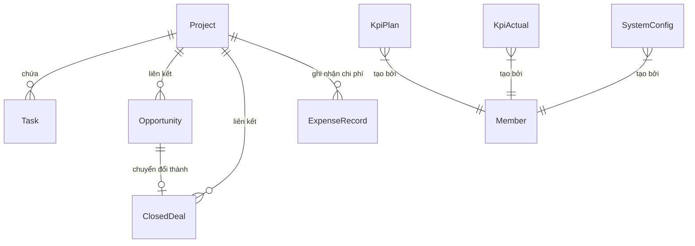

# Tài liệu chi tiết: Module 2 - Quản lý Dự án & Công việc (Projects & Tasks)

Tài liệu này cung cấp hướng dẫn onboarding và đặc tả kỹ thuật cực kỳ chi tiết cho từng API trong module **Projects & Tasks**. Mọi Endpoint đều được làm rõ về File code xử lý, Dữ liệu đầu vào (Input), Dữ liệu phản hồi (Output) và các ràng buộc nghiệp vụ (Business Rules).

---

## 💡 1. Bối cảnh nghiệp vụ (Business Context)

Module này giải quyết 4 bài toán quản trị chính của Marketing Hub:
1. **Quản lý Dự án (Projects):** Thiết lập thông tin cơ bản, quản lý ngân sách và so sánh các chỉ tiêu KPI (Kế hoạch vs Thực tế) theo từng dự án.
2. **Quy trình công việc (Task Workflow):** Quản lý tiến độ công việc qua Kanban Board với các trạng thái nghiệp vụ chặt chẽ, hỗ trợ phân cấp độ ưu tiên, đính kèm tài liệu và phân vai trò người liên quan (Stakeholders).
3. **Báo cáo Tuần tự động (Weekly Reports):** Tổng hợp tự động các công việc đã làm trong tuần, kế hoạch tuần tới, các vấn đề tồn đọng (Backlog) và những điểm cần Ban giám đốc (BOD) hỗ trợ.
4. **Tối ưu hóa thao tác (Automation & Import):** Tự động sinh danh mục công việc chuẩn (Checklist Template) khi tạo các dự án sự kiện; hỗ trợ nhập nhanh danh sách công việc hàng loạt từ file Excel/CSV.

---

## 🗄️ 2. Sơ đồ dữ liệu & Mối quan hệ liên quan (Database Schema Relationships)



* **`Project`**: Lưu thông tin các dự án. Chỉ các dự án có `status: "Active"` mới được dùng để tổng hợp trên Dashboard, tuy nhiên module này quản lý tất cả trạng thái của dự án.
* **`Task`**: Các đầu việc cụ thể trong dự án, liên kết trực tiếp với dự án thông qua `projectId` và người phụ trách thông qua `assigneeId`.
* **`Member`**: Lưu trữ danh sách thành viên trong hệ thống (với vai trò `manager` hoặc `specialist`).
* **`WeeklyReportLog`**: Lưu trữ các ghi chú tự do dạng văn bản (Done, Plan, Backlog, BOD Support) được cập nhật thủ công bởi người quản lý cho mỗi tuần.

---

## 🛠️ 3. Các quy tắc nghiệp vụ đặc trưng

### A. Tự động sinh Checklist cho dự án Sự kiện (Event Template Checklist)
* **Loại dự án áp dụng:** `Workshop`, `Event`, `Exhibition`, `Webinar`.
* **Thuật toán phân bổ thời gian:**
  * Hệ thống có sẵn danh sách 11 đầu việc chuẩn (`EVENT_CHECKLIST`).
  * Khi tạo dự án với cờ `applyTemplate: true`, hệ thống sẽ tính khoảng cách thời gian từ lúc tạo đến `deadline`.
  * Các đầu việc sẽ được phân bổ hạn chót (`dueDate`) rải đều theo tỉ lệ tuyến tính từ $1/11$ đến $11/11$ khoảng thời gian đó.
  * Mỗi công việc sẽ tự động được tính tuần ISO (`execWeek`) và năm (`execYear`) dựa trên ngày hạn chót được phân bổ.
  * **Tính toàn vẹn (Transaction):** Nếu việc tạo bất kỳ Task nào trong Template bị lỗi, hệ thống sẽ thực hiện rollback toàn bộ (xóa dự án vừa tạo) để đảm bảo không bị rác dữ liệu.

### B. Logic sắp xếp mức độ ưu tiên hiển thị Task (Sorting Rank)
Khi lấy danh sách Task, hệ thống tự động sắp xếp theo thứ tự ưu tiên giảm dần về độ khẩn cấp (giúp lập trình viên FE không cần viết lại logic sắp xếp):
1. **Ưu tiên 1 (Rank 0):** Công việc đã quá hạn (`isOverdue = true`).
2. **Ưu tiên 2 (Rank 1):** Công việc sắp đến hạn trong vòng 5 ngày (`isUpcoming = true`).
3. **Ưu tiên 3 (Rank 2):** Công việc đang làm (`In Progress`).
4. **Ưu tiên 4 (Rank 3):** Công việc cần làm (`To Do`).
5. **Ưu tiên 5 (Rank 4):** Công việc chờ duyệt (`Review`).
6. **Ưu tiên 6 (Rank 5):** Các trạng thái khác.
* *Sắp xếp phụ:* Nếu cùng hạng ưu tiên, Task nào có hạn chót (`dueDate`) gần hơn sẽ xếp lên trước.

### C. Cơ chế Import Task từ Excel/CSV dạng 2 bước (Dry-run & Commit)
Để tránh lỗi định dạng khi import file dữ liệu lớn, API Import hoạt động theo cơ chế an toàn:
* **Bước 1 (Dry-run) - `confirm: false`:**
  * Parse file CSV/XLSX. Kiểm tra tính hợp lệ của từng dòng: Tên dự án có tồn tại không? Người phụ trách (`assignee`) có trong hệ thống không? Định dạng ngày tháng, số tuần có đúng không?
  * Không ghi vào database. Chỉ trả về kết quả kiểm tra gồm: Tổng số dòng, số dòng hợp lệ, số dòng lỗi và mảng chi tiết lỗi của từng dòng.
* **Bước 2 (Commit) - `confirm: true`:**
  * Hệ thống kiểm tra lại, nếu vẫn còn dòng lỗi sẽ chặn lại ngay lập tức và ném lỗi `BadRequestException`.
  * Nếu 100% dữ liệu hợp lệ, hệ thống sẽ chạy vòng lặp tạo Task trong database và ghi nhận nhật ký import vào bảng `ImportLog`.

---

## 🚀 4. Đặc tả chi tiết từng API Endpoint

### 🔐 Yêu cầu xác thực chung
Tất cả các API dưới đây đều yêu cầu đính kèm Header `Authorization: Bearer <JWT_TOKEN>`.
Các guard áp dụng: `JwtAuthGuard`, `RolesGuard`.

---

### PHÂN NHÓM A: QUẢN LÝ DỰ ÁN (PROJECTS)
Đường dẫn cơ sở: `/v1/projects`

#### API 1: Lấy danh sách tất cả các dự án
* **Endpoint:** `GET /v1/projects`
* **File xử lý:** [projects.controller.ts](../BE/src/modules/projects-tasks/projects.controller.ts) $\rightarrow$ `findAll()`
* **Service:** [projects.service.ts](../BE/src/modules/projects-tasks/projects.service.ts) $\rightarrow$ `findAll()`
* **Input (Query Params):** Không có.
* **Output:** Mảng chứa danh sách dự án kèm thông tin tổng hợp KPIs, ngân sách và tiến độ:
  ```json
  [
    {
      "id": "8e3c79a4-2e92-4fdb-85d9-366a3d1dfcfc",
      "name": "Chiến dịch Thương hiệu Q3",
      "type": "Client",
      "status": "Active",
      "ownerId": "member-uuid-1",
      "deadline": "2026-09-30T17:00:00.000Z",
      "budgetPlanDirect": 50000000,
      "budgetPlanOverhead": 10000000,
      "actualCostDirect": 45000000,
      "actualCostOverhead": 12000000,
      "createdBy": "admin-uuid",
      "createdAt": "2026-07-16T08:00:00.000Z",
      "updatedAt": "2026-07-16T08:00:00.000Z",
      "budgetPlanTotal": 60000000,
      "actualCostTotal": 57000000,
      "owner": {
        "id": "member-uuid-1",
        "name": "Nguyễn Văn A",
        "avatarUrl": "https://avatar.com/a.png"
      },
      "tasks": [
        {
          "id": "task-uuid-1",
          "name": "Lên Outline kế hoạch",
          "dueDate": "2026-07-20T17:00:00.000Z",
          "assignee": {
            "id": "member-uuid-2",
            "name": "Trần Thị B",
            "avatarUrl": null
          }
        }
      ],
      "kpis": [
        { "key": "rawLeads", "plan": 100, "actual": 85, "percent": 85.0 },
        { "key": "mql", "plan": 50, "actual": 40, "percent": 80.0 },
        { "key": "sql", "plan": 30, "actual": 20, "percent": 66.7 },
        { "key": "opp", "plan": 15, "actual": 10, "percent": 66.7 },
        { "key": "closedDeal", "plan": 5, "actual": 4, "percent": 80.0 },
        { "key": "pipelineValue", "plan": 200000000, "actual": 150000000, "percent": 75.0 }
      ],
      "progress": {
        "percentage": 80.0,
        "total": 5,
        "done": 4,
        "processing": 1,
        "overdue": 0
      }
    }
  ]
  ```

#### API 2: Lấy chi tiết một dự án theo ID
* **Endpoint:** `GET /v1/projects/:id`
* **File xử lý:** [projects.controller.ts](../BE/src/modules/projects-tasks/projects.controller.ts) $\rightarrow$ `findOne()`
* **Input (Param):** `id` *(string, UUID hoặc chuỗi ID bất kỳ, required)* - ID dự án.
* **Output:** Đối tượng duy nhất tương tự như cấu trúc phần tử của API 1 nhưng lọc riêng theo ID.

#### API 3: Tạo mới một dự án
* **Endpoint:** `POST /v1/projects`
* **File xử lý:** [projects.controller.ts](../BE/src/modules/projects-tasks/projects.controller.ts) $\rightarrow$ `create()`
* **Input (Body):** `CreateProjectDto`
  ```json
  {
    "name": "Chiến dịch Viral TikTok",
    "type": "Client",
    "status": "Planning",
    "ownerId": "8e3c79a4-2e92-4fdb-85d9-366a3d1dfcfc",
    "deadline": "2026-08-30",
    "applyTemplate": true,
    "budgetPlanDirect": 15000000,
    "budgetPlanOverhead": 5000000,
    "kpiRawLeadsPlan": 500,
    "kpiMqlPlan": 200
  }
  ```
* **Output:** Đối tượng dự án vừa được tạo thành công kèm đầy đủ các thông tin tính toán tương tự API 1.

#### API 4: Cập nhật thông tin dự án
* **Endpoint:** `PATCH /v1/projects/:id`
* **File xử lý:** [projects.controller.ts](../BE/src/modules/projects-tasks/projects.controller.ts) $\rightarrow$ `update()`
* **Input (Param):** `id` *(string, UUID hoặc chuỗi ID bất kỳ, required)*
* **Input (Body):** `UpdateProjectDto` (Là Partial của `CreateProjectDto`).
* **Output:** Đối tượng dự án sau khi cập nhật thành công.

#### API 5: Xóa một dự án
* **Endpoint:** `DELETE /v1/projects/:id`
* **File xử lý:** [projects.controller.ts](../BE/src/modules/projects-tasks/projects.controller.ts) $\rightarrow$ `remove()`
* **Tác dụng:** Xóa dự án cùng tất cả các Task liên quan thông qua Transaction.
* **Input (Param):** `id` *(string, UUID hoặc chuỗi ID bất kỳ, required)*
* **Output:**
  ```json
  {
    "message": "Xóa project thành công"
  }
  ```

---

### PHÂN NHÓM B: QUẢN LÝ CÔNG VIỆC (TASKS)
Đường dẫn cơ sở: `/v1/tasks`

#### API 6: Lấy danh sách công việc (Kèm Bộ Lọc & Thống Kê)
* **Endpoint:** `GET /v1/tasks`
* **File xử lý:** [tasks.controller.ts](../BE/src/modules/projects-tasks/tasks.controller.ts) $\rightarrow$ `findAll()`
* **Service:** [tasks.service.ts](../BE/src/modules/projects-tasks/tasks.service.ts) $\rightarrow$ `findAll()`
* **Input (Query Params):** `TaskFilterDto`
  * `projectId` *(string, UUID hoặc chuỗi ID bất kỳ, optional)*: Lọc theo dự án.
  * `status` *(string, optional)*: Lọc theo trạng thái.
  * `priority` *(string, optional)*: Lọc theo độ ưu tiên.
  * `assigneeId` *(string, UUID hoặc chuỗi ID bất kỳ, optional)*: Lọc theo người phụ trách.
  * `dueDateFrom` *(string, ISO Date, optional)*: Tìm hạn chót từ ngày.
  * `dueDateTo` *(string, ISO Date, optional)*: Tìm hạn chót đến ngày.
* **Output:**
  ```json
  {
    "data": [
      {
        "id": "task-uuid-1",
        "name": "Thiết kế Banner Facebook Ads",
        "description": "Yêu cầu tone màu xanh dương chủ đạo",
        "projectId": "project-uuid-1",
        "assigneeId": "member-uuid-2",
        "status": "In Progress",
        "priority": "High",
        "startDate": "2026-07-15T00:00:00.000Z",
        "dueDate": "2026-07-20T17:00:00.000Z",
        "completedDate": null,
        "execWeek": 30,
        "execYear": 2026,
        "reason": null,
        "neededSupportBod": null,
        "link": "https://figma.com/design-file",
        "remark": null,
        "createdAt": "2026-07-15T08:00:00.000Z",
        "updatedAt": "2026-07-16T08:00:00.000Z",
        "project": {
          "id": "project-uuid-1",
          "name": "Chiến dịch Thương hiệu Q3",
          "type": "Client"
        },
        "assignee": {
          "id": "member-uuid-2",
          "name": "Trần Thị B",
          "avatarUrl": null
        },
        "stakeholders": ["BOD", "Sales Team"],
        "isOverdue": false,
        "isUpcoming": true
      }
    ],
    "stats": {
      "total": 1,
      "Planning": 0,
      "Processing": 0,
      "Done": 0,
      "Pending": 0,
      "Cancel": 0,
      "Overdue": 0,
      "Backlog": 0,
      "To Do": 0,
      "In Progress": 1,
      "Review": 0,
      "overdue": 0,
      "upcoming": 1
    }
  }
  ```

#### API 7: Lấy dữ liệu công việc nhóm theo cột Kanban (Kanban Board)
* **Endpoint:** `GET /v1/tasks/kanban/board`
* **File xử lý:** [tasks.controller.ts](../BE/src/modules/projects-tasks/tasks.controller.ts) $\rightarrow$ `kanban()`
* **Input (Query Params):** `TaskFilterDto`.
* **Output:**
  ```json
  [
    {
      "status": "To Do",
      "count": 1,
      "tasks": [
        {
          "id": "task-uuid-2",
          "name": "Viết Content cho bài viết PR",
          "dueDate": "2026-07-22T17:00:00.000Z",
          "status": "To Do"
        }
      ]
    },
    {
      "status": "In Progress",
      "count": 0,
      "tasks": []
    }
  ]
  ```

#### API 8: Tải file mẫu CSV để chuẩn bị dữ liệu Import Tasks
* **Endpoint:** `GET /v1/tasks/import/template`
* **File xử lý:** [tasks.controller.ts](../BE/src/modules/projects-tasks/tasks.controller.ts) $\rightarrow$ `template()`
* **Headers phản hồi:**
  * `Content-Type: text/csv; charset=utf-8`
  * `Content-Disposition: attachment; filename="task-import-template.csv"`

#### API 9: Nhập danh sách công việc hàng loạt từ file CSV/Excel
* **Endpoint:** `POST /v1/tasks/import`
* **File xử lý:** [tasks.controller.ts](../BE/src/modules/projects-tasks/tasks.controller.ts) $\rightarrow$ `import()`
* **Service:** [task-import.service.ts](../BE/src/modules/projects-tasks/task-import.service.ts) $\rightarrow$ `parse()`
* **Headers yêu cầu:** `Content-Type: multipart/form-data`
* **Input (Multipart Body):**
  * `file` *(file binary, bắt buộc)*: File định dạng `.csv` hoặc `.xlsx`.
  * `projectId` *(string, UUID hoặc chuỗi ID bất kỳ, optional)*: Project ID mặc định.
  * `confirm` *(string/boolean, optional)*: `"true"` (Commit) hoặc `"false"` (Dry-run).
* **Output khi confirm = false:**
  ```json
  {
    "totalRows": 15,
    "validRows": 13,
    "errorRows": 2,
    "preview": [
      {
        "row": 2,
        "errors": [],
        "data": { "name": "Task hợp lệ 1", "projectId": "...", "status": "To Do" }
      }
    ],
    "errors": [
      {
        "row": 3,
        "errors": [ "assignee không hợp lệ hoặc không tồn tại" ],
        "data": { "name": "Task lỗi", "projectId": "..." }
      }
    ]
  }
  ```

#### API 10: Lấy chi tiết công việc theo ID
* **Endpoint:** `GET /v1/tasks/:id`
* **File xử lý:** [tasks.controller.ts](../BE/src/modules/projects-tasks/tasks.controller.ts) $\rightarrow$ `findOne()`
* **Input (Param):** `id` *(string, UUID hoặc chuỗi ID bất kỳ, required)*
* **Output:** Đối tượng chi tiết của Task (cấu trúc tương tự như phần tử dữ liệu của API 6).

#### API 11: Tạo mới một công việc
* **Endpoint:** `POST /v1/tasks`
* **File xử lý:** [tasks.controller.ts](../BE/src/modules/projects-tasks/tasks.controller.ts) $\rightarrow$ `create()`
* **Input (Body):** `CreateTaskDto`
  ```json
  {
    "name": "Thiết kế banner Facebook Ads",
    "projectId": "8e3c79a4-2e92-4fdb-85d9-366a3d1dfcfc",
    "assigneeId": "member-uuid-2",
    "priority": "Medium",
    "dueDate": "2026-07-20",
    "execWeek": 30,
    "execYear": 2026,
    "status": "To Do",
    "description": "Banner giới thiệu sản phẩm mới",
    "stakeholders": ["BOD", "CS Team"],
    "startDate": "2026-07-15"
  }
  ```
* **Output:** Đối tượng Task vừa tạo thành công.

#### API 12: Cập nhật thông tin công việc
* **Endpoint:** `PATCH /v1/tasks/:id`
* **File xử lý:** [tasks.controller.ts](../BE/src/modules/projects-tasks/tasks.controller.ts) $\rightarrow$ `update()`
* **Input (Param):** `id` *(string, UUID hoặc chuỗi ID bất kỳ, required)*
* **Input (Body):** `UpdateTaskDto` (Partial của `CreateTaskDto`).
* **Output:** Đối tượng Task sau khi cập nhật.

#### API 13: Xóa công việc
* **Endpoint:** `DELETE /v1/tasks/:id`
* **File xử lý:** [tasks.controller.ts](../BE/src/modules/projects-tasks/tasks.controller.ts) $\rightarrow$ `remove()`
* **Output:**
  ```json
  {
    "message": "Xóa task thành công"
  }
  ```

---

### PHÂN NHÓM C: BÁO CÁO TUẦN (WEEKLY REPORTS)
Đường dẫn cơ sở: `/v1/weekly-reports`

#### API 14: Lấy dữ liệu báo cáo tuần
* **Endpoint:** `GET /v1/weekly-reports`
* **File xử lý:** [weekly-reports.controller.ts](../BE/src/modules/projects-tasks/weekly-reports.controller.ts) $\rightarrow$ `getReport()`
* **Service:** [weekly-reports.service.ts](../BE/src/modules/projects-tasks/weekly-reports.service.ts) $\rightarrow$ `getReport()`
* **Input (Query Params):** `WeeklyReportQueryDto`
  * `week` *(number, required)*: Tuần cần lấy báo cáo (1-53).
  * `year` *(number, required)*: Năm cần lấy báo cáo.
  * `projectId` *(string, UUID hoặc chuỗi ID bất kỳ, optional)*.
  * `memberId` *(string, UUID hoặc chuỗi ID bất kỳ, optional)*.
* **Output:**
  ```json
  {
    "title": "Weekly Report — Tuần 30/2026",
    "period": {
      "from": "2026-07-20T00:00:00.000Z",
      "to": "2026-07-26T00:00:00.000Z",
      "week": 30,
      "year": 2026
    },
    "filters": {
      "projectId": null,
      "memberId": null
    },
    "sections": {
      "done": [ /* Danh sách tasks hoàn thành trong tuần */ ],
      "nextWeekPlan": [ /* Danh sách tasks kế hoạch tuần sau */ ],
      "backlog": [ /* Danh sách tasks trễ hạn hoặc tồn đọng */ ],
      "bodSupport": [ /* Danh sách các công việc cần BOD hỗ trợ */ ]
    },
    "log": {
      "id": "log-uuid",
      "year": 2026,
      "week": 30,
      "doneNotes": "Tuần này chiến dịch chạy rất tốt",
      "planNotes": "Tập trung tối ưu kênh truyền thông mới",
      "backlogNotes": "Gặp vấn đề về thiết kế",
      "bodNotes": "Cần thêm nhân sự hỗ trợ"
    }
  }
  ```

#### API 15: Lưu/Cập nhật ghi chú cho báo cáo tuần
* **Endpoint:** `POST /v1/weekly-reports/logs`
* **File xử lý:** [weekly-reports.controller.ts](../BE/src/modules/projects-tasks/weekly-reports.controller.ts) $\rightarrow$ `saveLog()`
* **Input (Body):** `SaveWeeklyLogDto`
  ```json
  {
    "week": 30,
    "year": 2026,
    "projectId": null,
    "memberId": null,
    "doneNotes": "Nội dung cập nhật công việc hoàn thành...",
    "planNotes": "Kế hoạch tuần sau...",
    "backlogNotes": "Vấn đề tồn đọng...",
    "bodNotes": "Yêu cầu hỗ trợ..."
  }
  ```
* **Output:** Ghi chú (`WeeklyReportLog`) vừa được cập nhật hoặc tạo mới.

#### API 16: Xuất báo cáo tuần ra tệp văn bản (.txt)
* **Endpoint:** `GET /v1/weekly-reports/export.txt`
* **File xử lý:** [weekly-reports.controller.ts](../BE/src/modules/projects-tasks/weekly-reports.controller.ts) $\rightarrow$ `exportText()`
* **Tác dụng:** Trả về file văn bản thô `.txt` đã định dạng.
* **Input (Query Params):** `WeeklyReportQueryDto`.
* **Định dạng file trả về:**
  ```text
  📊 WEEKLY REPORT — TUẦN 30/2026 (2026-07-20–2026-07-26)
  ════════════════════════════════════

  ✅ CÔNG VIỆC ĐÃ HOÀN THÀNH
  • Viết kịch bản truyền thông — Nguyễn Văn A (Chiến dịch Tết)
  ```

---

### PHÂN NHÓM D: QUẢN LÝ THÀNH VIÊN (MEMBERS)
Đường dẫn cơ sở: `/members`

#### API 17: Lấy danh sách tất cả thành viên trong hệ thống
* **Endpoint:** `GET /members`
* **File xử lý:** [members.controller.ts](../BE/src/modules/projects-tasks/members.controller.ts) $\rightarrow$ `findAll()`
* **Output:**
  ```json
  [
    {
      "id": "member-uuid-1",
      "memberId": 1,
      "name": "Nguyễn Văn A",
      "email": "a.nguyen@company.com",
      "role": "manager",
      "avatarUrl": "https://avatar.com/a.png",
      "isActive": true
    }
  ]
  ```

#### API 18: Cập nhật vai trò (Role) của thành viên
* **Endpoint:** `PATCH /members/:id/role`
* **File xử lý:** [members.controller.ts](../BE/src/modules/projects-tasks/members.controller.ts) $\rightarrow$ `updateRole()`
* **Phân quyền:** Chỉ `manager` mới được phép gọi.
* **Input (Param):** `id` *(string, required)*
* **Input (Body):** `UpdateRoleDto`
  ```json
  {
    "role": "manager"
  }
  ```
* **Output:**
  ```json
  {
    "id": "member-uuid-2",
    "name": "Trần Thị B",
    "email": "b.tran@company.com",
    "role": "manager"
  }
  ```

---

## 💡 5. Hướng dẫn sửa đổi code (Developer Guidelines)

1. **Transaction trong Prisma:**
   * Khi thực hiện các hành động tạo/xóa liên quan đến nhiều bảng cùng lúc (ví dụ: Xóa dự án đi kèm xóa task, hay Tạo dự án sự kiện đi kèm tạo checklist), hãy luôn bọc các câu lệnh trong `prisma.$transaction([])` để tránh tình trạng dữ liệu mồ côi (orphan records).
2. **Quy định bắt buộc nhập lý do (Reason Validation):**
   * Nếu bạn định nghĩa thêm trạng thái công việc mới trong file [projects-tasks.constants.ts](../BE/src/modules/projects-tasks/projects-tasks.constants.ts) mà trạng thái đó cần giải trình lý do từ người dùng, nhớ cập nhật thêm điều kiện kiểm tra trong hàm `validateBusinessRules()` của [tasks.service.ts](../BE/src/modules/projects-tasks/tasks.service.ts).
3. **Múi giờ khi Import Excel:**
   * Thư viện `exceljs` tự động nhận diện các cột định dạng Date. Tuy nhiên, khi chuyển sang database Postgres, hãy đảm bảo thời gian đã được chuẩn hóa sang chuỗi ISO UTC trước khi lưu để tránh lệch 1 ngày do lệch múi giờ local (+7).
